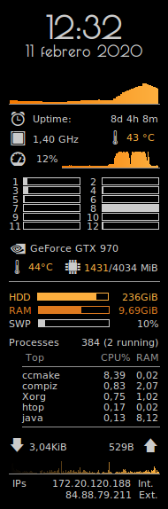

# myconky
My conky configuration, it shows CPU load, RAM usage, GPU memory, running processes, IPs,...

Save `conkyrc` as `.conkyrc` in your home directory.

Install and launch Conky.
```shell
$ sudo apt-get update
$ sudo apt-get install conky-all
$ conky
```


